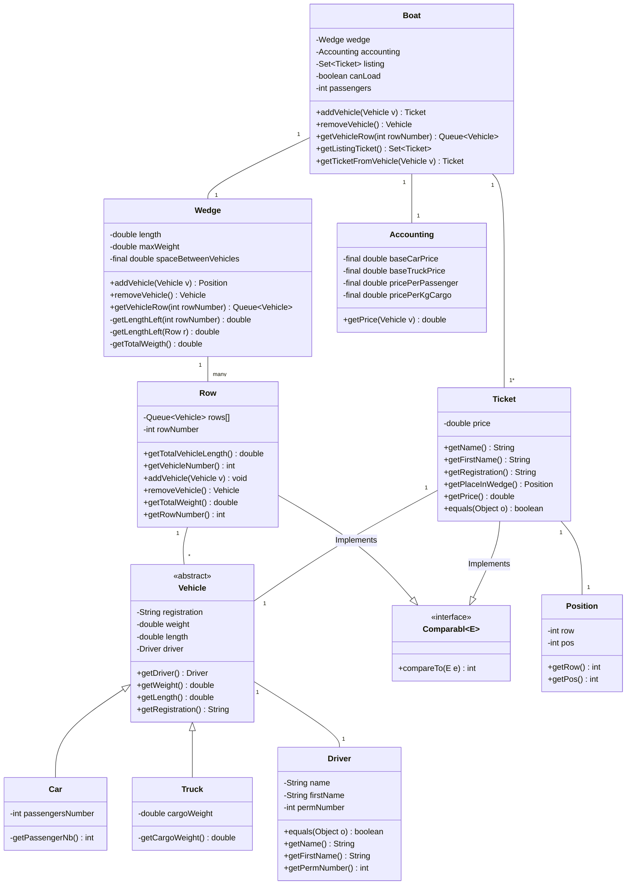

# Analise du projet Carferry

```mermaid

classDiagram

Boat "1" -- "1" Wedge
Boat "1" -- "1*" Ticket
Boat "1" -- "1" Accounting

Row "1" -- "*" Vehicle
Row --|> Comparabl~E~ : Implements
Wedge "1" -- "many" Row
Vehicle <|-- Car
Vehicle <|-- Truck
Vehicle "1" -- "1" Driver
Ticket "1" -- "1" Vehicle
Ticket --|> Comparabl~E~ : Implements
Ticket "1" -- "1" Position

class Comparabl~E~ {
    <<interface>>

    +compareTo(E e) int
}

class Position {
    -int row
    -int pos

    +getRow() int
    +getPos() int
}

class Driver {
    -String name
    -String firstName
    -int permNumber

    +equals(Object o) boolean
    +getName() String
    +getFirstName() String
    +getPermNumber() int
}

class Vehicle {
    <<abstract>>
    -String registration
    -double weight
    -double length
    -Driver driver

    +getDriver() Driver
    +getWeight() double
    +getLength() double
    +getRegistration() String
}

class Car {
    -int passengersNumber

    -getPassengerNb() int
}

class Truck {
    -double cargoWeight

    -getCargoWeight() double
}

class Row {
    -Queue~Vehicle~ rows[]
    -int rowNumber

    +getTotalVehicleLength() double
    +getVehicleNumber() int
    +addVehicle(Vehicle v) void
    +removeVehicle() Vehicle
    +getTotalWeight() double
    +getRowNumber() int
}

class Wedge {
    -double length
    -double maxWeight
    -final double spaceBetweenVehicles
    

    +addVehicle(Vehicle v) Position
    +removeVehicle() Vehicle
    +getVehicleRow(int rowNumber) Queue~Vehicle~
    -getLengthLeft(int rowNumber) double
    -getLengthLeft(Row r) double
    -getTotalWeigth() double
}

class Ticket {
    -double price
    
    +getName() String
    +getFirstName() String
    +getRegistration() String

    +getPlaceInWedge() Position
    +getPrice() double
    +equals(Object o) boolean
}

class Accounting {
    -final double baseCarPrice
    -final double baseTruckPrice
    -final double pricePerPassenger
    -final double pricePerKgCargo

    +getPrice(Vehicle v) double
}

class Boat {
    -Wedge wedge
    -Accounting accounting
    -Set~Ticket~ listing
    -boolean canLoad
    -int passengers

    +addVehicle(Vehicle v) Ticket
    +removeVehicle() Vehicle
    +getVehicleRow(int rowNumber) Queue~Vehicle~
    +getListingTicket() Set~Ticket~
    +getTicketFromVehicle(Vehicle v) Ticket
}
```
