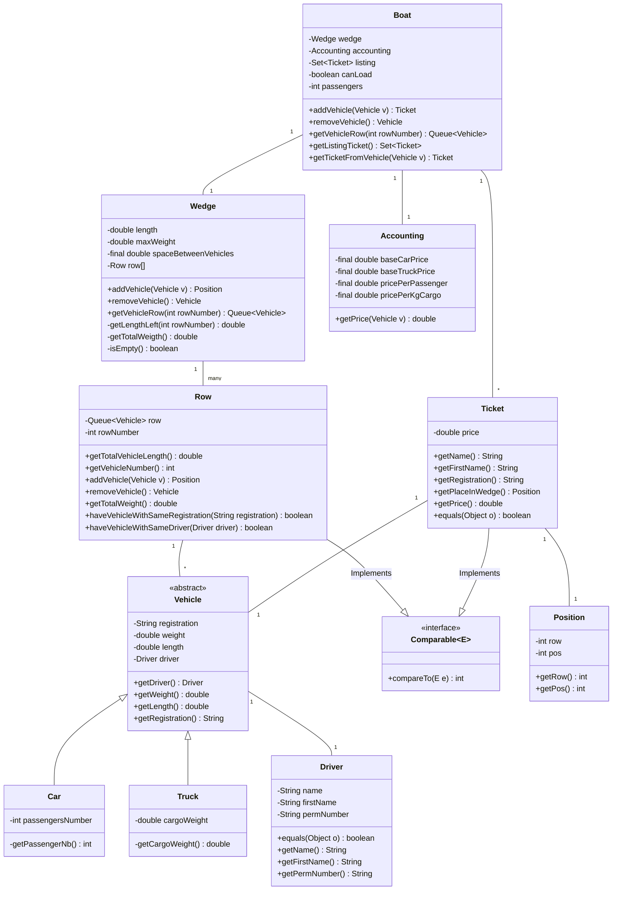
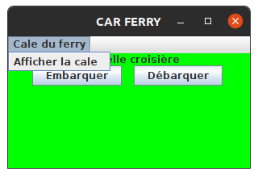
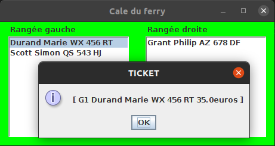
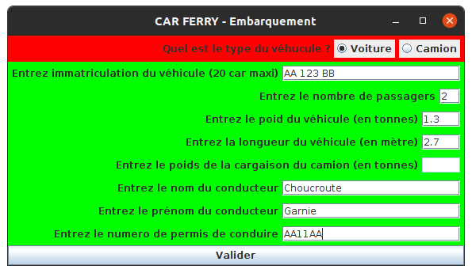
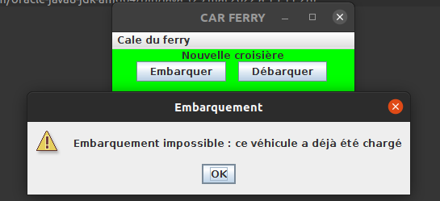
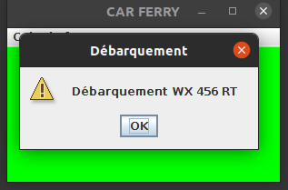

# Project Carferry

## Université de Franche-Comté

### Alphée GROSDIDIER & Quentin OBERON

Rapport demandé en français

## Présentation de l'applications

### Sujet

Il nous était demandé de créer une application tout d'abord sous forme textuelle puis sous forme graphique de gestion de chargement et déchargement d'un ferry avec gestion des tickets.

Tout d'abord nous devions créer une classe camion et voiture permettant respectivement de charger et décharger un camion et une voiture.
Les deux types de véhicules doivent pouvoir avoir un conducteur, une plaque d'immatriculation, une longueur et un poids.
Plus spécifiquement un camion doit avoir le poid de se cargaison et une voiture, le nombre de passager qu'elle transporte.

Le conducteur est défini pas un nom et un prénom ainsi qu'un permis de conduire.

La cale doit pouvoir contenir des camions et des voitures, elle doit permettre dès les charger et de les décharger.
Elle a plusieurs particularités. Elle peut contenir seulement une certaine masse définit en Tonnes et à une certaine longueur définit en mètres.
De plus on doit répartir équitablement les véhicules pour que le bateau ne penche pas plus d'un côté que de l'autre.
Les véhicules sont chargés en file, c’est-à-dire que le dernier véhicule chargé doit sortir en dernier et le premier chargé doit sortir en premier.

On a une gestion indépendante du prix des camions et des voitures.
Un camion coute pour la traversée un prix de 45€ + 0.1€ * (poids de sa cargaison).
Une voiture coute (avec son conducteur) 35€ + 3€ * (nombre de passagers).
Un ticket est créé lors de l'embarquement.

Le ticket est composé du nom et prénom du conducteur, de la position du véhicule dans la cale et du tarif du voyage.
La position du ticket est notée par la lettre de la rangée et la position dans la rangée.
La lettre est soit "G" pour gauche soit "D" pour droite.
Les tickets sont enregistrées et triées par ordre alphabétique des conducteurs.

Il y aura aussi une gestion des erreurs d'embarquement pour une cale qui ne peut pas accepter le véhicule car il est trop lourd ou parce qu'il est trop long et qu'il n'y a plus de place.

### Nos Choix

#### Les choix sur l'interface textuelle

Nous avons tout d'abord construit l'application de façon textuelle.
Sachant que nous devions ensuite la porter en mode graphique, nous avons faits une classe regroupant toutes les méthodes dont nous aurions besoin pour développer notre interface.
Nous sommes partis sur l'interface nommée "Boat".

Nous avons ensuite choisi de bien séparer nos modules (nos classes) pour que le projet soit lisible et pour que l'implémentation de nouvelles fonctionnalités soit plus simple.
Nous avons donc choisi de creer un module qui se chargerait de la gestion des véhicules dans l'application et un autre du prix du trajet.
La liste des tickets du trajet a été laissé dans cette classe pour ne pas s'encombrer de plus de méthodes dans la classe "Wedge".

Par rapport au sujet nous avons prix la liberté de modifier la classe véhicule.
Nous n'avons pas ajouté une méthode abstraite dans la classe véhicule pour avoir le prix du véhicule mais nous avons plutôt fait une classe qui se charge de donner le prix.
Ce choix a été principalement fait pour donner plus de lisibilité dans le projet en regroupant le même type d'information au même endroit, ici le prix.

Un autre choix qui est différent de celui proposé dans le sujet est celui de la classe ticket.
Nous avons tout d'abord changé la façon d'enregistrer la position du véhicule dans la cale.
Nous avons creer une classe position qui nous permet de transmettre plus facilement la rangée et la position dans la rangée.
Puis nous n'enregistrons pas la rangée avec une lettre "G" ou "D" mais avec un nombre permettant d'avoir un nombre indéfini de rangée.

Sur ticket nous avons aussi pris la liberté d'enregistrer directement le véhicule et pas les informations relatives au conducteur et au véhicule.
Nous avons faits ce choix pour éviter la duplication d'information même si, une fois enregistré, le véhicule ne peut plus changer.

On a aussi décidé d'enregistrer les véhicules dans des classes "Row" pour nous simplifier les algorithmes au lieu de faire une liste statique de queue.

Pour les points les futiles, nous avons ajouté une vérification de certaines erreurs d'enregistrement courant comme l'ajout de deux fois le même véhicule, le même conducteur pour deux véhicules différents et l'ajout d'un véhicule alors qu'on fait un débarquement.

#### Les choix sur l'interfaces graphique

Nous avons voulu rester au plus proche de ce qui était demandé. Nous n'avons donc pas changé la couleur (ça pique les yeux, désolé) et nous avons essayé de rester au plus proche de l'interface qui nous étaient présentée en images.

Nous avons cependant fait quelques modifications sur l'affichage des fenêtres.
Nous pouvons à la fois ouvrir la fenêtre de la cale et ajouter ou supprimer des véhicules.
L'interface de la cale se met automatiquement à jour suite à l'ajout ou la suppression d'un véhicule.
Et il y a un affichage de tous les messages d'erreur suite à un ajout impossible du véhicule.

Nous avons aussi fait quelques changements sur la fenêtre d'ajout d'un véhicule.
Il y a un formatage automatique des nombres pour le poids du véhicule, le nombre de passagers et le poids de la cargaison.
Pour le reste des champs de saisis ils sont seulement vérifiés lors de la validation du formulaire.

Ce sont les seules libertés que nous avons prises par rapport au sujet.

## Conception de l'application

### Diagramme

### Boat

C'est la classe principale de l'application en mode console.
Elle centralise toutes les opérations de l'application et permet la communication entre la cale du bateau (wedge), la billetrie et les prix (Accounting).
On a préféré gérer indépendamment la cale du bateau pour pouvoir inclure d'autres modules comme un module bar ou un bureau d'échange.
Tous les prix seront alors ajustés directement depuis le bateau.

Nous avons choisi à lister tous les tickets fait pour les véhicules dans le bateau directement mais nous aurions pu les mettres dans la cale, c'est un choix objectif qui a été fait.

Pour enregistrer les tickets nous avons choisi d'utiliser un set de la bibliothèque java.
Tous les tickets sont uniques, il n'y a qu'un conducteur pour chaque véhicule qui a chacun une plaque d'immatriculation unique.
On a aussi besoin des ordonnées selon le nom du conducteur donc on a une seule façon de faire l'implémentation du set.
On implémente le set avec un treeSet car on ne veut pas d'éléments nulle et il est plus simple de manipuler les élément a l'intérieur.

### Wedge

La Cale est la classe qui regroupe toutes les méthodes relatives à la disposition des véhicules dans le bateau.

Nous avons implémenté une liste statique de Row (rangée) car une collection était inutiles pour les opérations d'ajout et de suppression selon notre implémentation.
De plus une fois la création de l'instance Wedge on n'a aucun ajout ni suppression de rangée.
On a seulement besoin d'accéder à des rangées spécifiques.

Notre méthode d'ajout ou de suppression ne prend pas en compte la ligne de flottaison, elle permet simplement d'ajouter un véhicule à la rangée qui au moins de poids et de retirer le véhicule à celle qui a le plus de poids.

### Row

La classe rangée (ROW) permet l'ajout et la suppression des véhicules dans la rangée.
Elle comporte des méthodes pour connaitre son poids, le nombre de véhicules et les méthodes d'ajout et suppressions de véhicules.

Nous avons décidé d'utiliser une queue pour le stockage des véhicules.
Elle nous permet seulement l'ajout de véhicule en fin ce qu'est la suppression en fin de queue.
On a préféré utiliser la méthode que pour éviter d'enlever en premier le dernier véhicule ajouté ou l'inverse.
On a utilisé une LinkedList qui n'est pas forcément la plus efficace puisque l'opération d'ajout ou de suppression est d'O(n).
Cependant elle nous évite d'enlever ou ajouter un véhicule qui physiquement ne peux pas l'être.

Cette classe implémente la classe Comparable pour pouvoir ordonner les classes et trouver rapidement celle qui a le plus ou le moins de poids selon notre algorithme.

### Accounting

Cette classe a pour simple but de gérer les prix de tous les éléments vendables dans le bateau.
Elle enregistre les prix de chaque élément et on peut connaitre le prix de l'élément en appelant la méthode ge Price.

### Ticket

Cette classe enregistre les informations relatives aux tickets.
Elle implémente la classe Comparable pour pouvoir fonctionner avec le set de la classe bateau (Wedge).

Pour éviter la duplication de variables nous avons directement lié le véhicule au ticket
On a ajouté une classe Position pour enregistrer la position du véhicule dans la cale durant le voyage.

### Position

Cette classe enregistre la position de la voiture liée au ticket.
La rangée est enregistrée sous forme d'entier pour permettre de mettre un nombre illimité de rangée.
Il est demandé d'afficher la rangée droite par un D et la rangée gauche par un G.
Nou traitera ces cas par l'affichage et seulement pour un bateau à 2 rangées.

### Vehicle

La classe véhicule (Vehicle) est hérité par les camions (Truc) et voiture (car) permettant de les stocker dans une liste unique de véhicules.

Elle possède les fonctions de base qui sont le conducteur, la plaque d'immatriculation, le poids et la longueur qui sont communs aux camions et voiture.
Cette classe est abstraite puisqu'on ne peut charger un véhicule, seuls des camions et voiture.

Pour parler rapidement des classes voiture et camion.
La classe voiture permet d'enregistrer un nombre de passagers alors que les camions ne transportent pas des passagers mais des cargaisons (sauf transport illégal).

## Développement de l'application

### Points intéréssants

Dans cette partie nous avons décidé de parler des modifications importantes faites au projet qui diffèrent du sujet.
Nous allons donc parler de l'ajout d'un véhicule dans la cale puisque nous l'avons implémenté d'une manière particulière mais fonctionnelle.

#### Ajout des véhicules

Sur cette image nous avons le script d'ajout d'un véhicule au bateau. Les premières lignes ne sont pas intéressantes.
Elles ne servent qu'à vérifier que le poids du véhicule peut être supporté par le bateau.
C'est à partir de la ligne 69 que le code est intéressant.
On crée un set de rangées (ROW) dans laquelle on va ajouter toutes les rangées qui ont assez d'espaces pour accueillir la longueur du véhicule.
Et grace au set elle va les organiser selon leur méthodes compareTo qu'on détailleras un peu après.
On va donc mettre dans ce Set les rangées possibles pour mettre le véhicule.
Ensuite on vérifie qu'il y a à la moins une rangée de libre sinon on n'a plus d'espace disponible pour ce véhicule.
Et on ajoute à la rangée qui a le moins de poids, le véhicule.
On utilise la méthode "min" de collection pour nous donner ce résultat.
Cette opération est en O(1) car on a ordonné nos éléments par poids.
On peut voir comment est implémenter la méthode compareto de "ROW" pour vérifier que c'est le poids de chacune des rangées qui est comparé.

Sur cette capture d'écran on a la fonction compareTo de la classe "ROW" qui compare simplement le poid de la rangée avec une autre passé en paramètre.
Le poid de la rangée est le poid de tous les véhicules qui s'y trouvent.

#### Mise à jours des éléments de la fenetre de la cale

Dans ce bout de code on peut voir une fonction update.
Elle permet de mettre à jour la fenêtre montrant la cale du bateau.
La fonction setlistdata de leftrowlist et rightrowlist (J. List) permet de remplacer le contenu des JLisst par les arrays d'objet passé en paramètres.
Ce rôle est rempli par listdatavehicle qui va récupérer les informations de rangées et retourner un array d'objet.
Donc à chaque fois qu'on effectue une opération d'ajour ou de suppression de véhicule, on appele cette fonction pour mettre a jour la cale du bateau

#### Formattage des nombres dans le formulaire d'embarquement

On a choisi de faire un formatage des nombres directement dans l'interface graphique porc que l'interface soit plus simple et pour que les nombres soient correctement formatées.
Par exemple, oon ne veut pas que le nombre de passagers soit à virgule.
Il est difficile de concevoir qu'il y ait 1/3 d'une personne qui souhaite faire la traversée.

On a donc utilisé à la ligne 66 une instance d'Integer que l'on a mis au maximum à deux chiffres pour éviter de devoir transporter plus de 100 personnes.
On utilise ensuite a la ligne 92 un JFormattedText que l'on initialise avec notre instance d'Integer pour que les deux puissent fonctionner correctement.

Pour les nombres qui peuvent être de nombre à virgule on utilise des DecimalFormat avec lequel  on met un maximum de deux nombres après la virgule.
Puis on a décidé de changer le séparateur qui est initialement une virgule par un point.
Le tout pour faciliter la saisie de ces nombres.
Ensuite on instancie de la même façon la saisie pour le poids du véhicule à la ligne 97 et pour le poids de la cargaison à la ligne 102.

Le formatage se fait automatiquement lors du changement de la zone de saisie.

### Partage du travail

Le travail a été partagé dans le binôme en selon nos envies et les parties qui nous intéressaient les plus De faire de notre côté où selon la facile d'une personne a réalisé la tâche

### Les résultats obtenus

Voici les donées présentées (les prix sont des résultats que nous avons calculées a partir du sujet):

|            |                 |    tonnes    |  mètres  | conducteur |         |           |    entier    |  tonnes   | euros  |
| ---------- | :-------------: | :----------: | :------: | ---------- | ------- | :-------: | :----------: | :-------: | :----: |
|            | immatriculation | poids à vide | longueur | nom        | prénom  | N° permis | Nb passagers | Cargaison |  Prix  |
| Voiture v1 |   RM 1054 FF    |     1,2      |   4,2    | Martin     | Jeanne  |   22FF    |      2       |     /     |  41.0  |
| Voiture v2 |    PO 377 AA    |     1,4      |   4,5    | Dupont     | Vincent |    A55    |      1       |     /     |  38.0  |
| Voiture v3 |    WX 456 RT    |     1,2      |   5,3    | Durand     | Marie   |    B34    |      0       |     /     |  35.0  |
| Camion c1  |    AZ 678 DF    |      4       |    12    | Grant      | Philip  |   20FF    |      /       |    15     | 1545.0 |
| Camion c2  |    QS 543 HJ    |     5,2      |   13,5   | Scott      | Simon   |   B55JG   |      /       |   22,5    | 2295.0 |
| Camion c3  |    BN 321 XC    |     4,5      |    15    | Lambert    | Alain   |  C44Djk   |      /       |    18     | 1845.0 |

On nous a demandé de charger les véhicules dans cet ordre: c1, v1, v2, c2, v3, c3.
En vérifiant à la main, on a le 3ième camions qui ne peut être chargé dans la cale a cause d'un manque de place.
On peut donc vérifier que la première ligne du résultat du programme est correcte.

Puis il nous était demandé l'affichage de la cale symbolisé par "G" et "D'",de la liste des tickets et le débarquement complet de la cale en affichant les véhicules qui débarquent.

Donc sur cette capture décan, les résultats sont corrects et correspondent aux attentes.

Les résultats les plus interréssants sont sur l'interface graphique.

Dans cette capture d'écran on a l'affichage de toutes les fenêtres simultanément.
On va parler de chaque fenêtre indépendamment pour montrer les différentes fonctionnalités implémentées.

La fenêtre principale a une barre de menus avec un objet permettant l'affichage de la cale.
Elle possède aussi 2 boutons, le premier permet l'embarquement d'un véhicule et le deuxième le débarque du véhicule adéquat.
La gestion de la possibilité d'embarquer est ggéréepar la fenêtre d'eembarcation

La fenêtre d'affichage de la cale montre tous les véhicules présents dans la cale. Ici le bateau n'a que 2 rangées et nous n'avons pas fait pour un affichage autre que 2 rangées.
Nous avons déjà chargé 3 véhicules. On voit sur cette image les informations du véhicule de Mme DURAND Marie en sélectionnant le véhicule sur l'interface (nécessite un double click).
On pourra vérifier que les informations sont justes et que les positions sont correctes. Malgré tous ce n'est que l'affichage du modèle prècèdament développé dans la partie console.

Pour expliquer rapidement cette fenêtre, on a tous les champs pour enregistrer un véhicule.
Les point a notées sont que pour une voiture, le champ du poid de la cargaison est innaccessible.
Nous n'avons pas de champ cargaison pour une voiture donc il ne sert a rien de l'activé.
Si tout se passe bien la fenêtre se ferme sans aucun message. Sinon une fenêtre indiqueras l'érreur qui est survenue.
On peux voir ici un exemple:

Sur cette image on a un exemple de déchargement avec les informations du véhicule qui est déchargée.

### Ce qui a été tésté

#### Dans le programme textuel

Pour la partie du programme qui sert de modèle, on a développé une suite de tests contenus dans Test boat.

Nous avons séparé nos tests en différentes catégories;

* le chargement

* le déchargement

* le gestion des tickets

* la gestion des prix

##### Le chargement

Nous avons tout d'abord testé si le bateau est bien vide lors de sa création.
Ensuite si le chargement d'un véhicule s'effectuait correctement puis si le chargement de plusieurs véhicules fonctionnait aussi et ne créait pas de problème
On a vérifié les exceptions liées aux chargements.
On effectue les tests pour vérifier que l'exception due à un manque de place en longueur et que l'exception due à un poids trop important est levée.

On vérifie aussi que le placement des véhicules correspond bien à ce que l'on a souhaité.
Et nous avons vérifié que le bateau ajoutait correctement les passagers sur le pont.
Et pour le bonus nous vérifions si le bateau n'a pas déjà chargé un véhicule avec un même conducteur ou un autre véhicule avec la même plaque d'immatriculation (car cencée être unique)

##### Le déchargement

Nous avons vérifié que le bateau se déchargeait correctement (comme on le souhaitait); 
Nous avons vérifié aussi que les passagers descendaient bien avec les bons véhicules.
Les tests vérifiaient aussi la présence des exceptions pour le déchargement lorsque le bateau est vide ainsi que le chargement alors que l'on est en train de décharger le bateau.
Dans la même logique on a vérifié que l'on pouvait remettre des véhicules dans le bateau après le déchargement complet.

##### La gestion des tickets

Lorsqu'on demande le ticket d'un véhicule qui n'existe pas, on vérifie que le retour est bien vide, on vérifie aussi dans le cas contraire que le ticket existe si le véhicule a été chargée.
Ensuite on fait une vérification que chaque élément du ticket est valide par rapport aux données attendues.

##### La gestions des prix

On a faits des vérifications succinctes pour cette classe comme c'est des calculs assez basiques.
On fait une vérification pour seulement quelques camions et quelques voitures.

#### Dans le programmme graphique

Pour tester la partie graphique nous n'avons pas créer des tests automatiques.
Nous avons donc vérifié manuellement les cas possibles d'utilisations.

### Ce qui n'as pas été implanté

Le programme-produit respecte les consignes et toutes les fonctionnalités demandées sont incluses dans le programme.
On a donc tout implémenté sans rien oublier (normalement).

Pour l'ajout d'un véhicule nous avons vérifié si chacun des paramètres était bien vérifié avant d'essayer d'ajouter le véhicule au bateau. Nous avons aussi fait la vérification que le bon type de véhicule était ajouté.
Pour ce qui est de l'interface en elle-même nous avons bien la désactivation des champs inutiles au véhicule (désactivation du champ passager pour les camions et désactivation du poids de la cargaison pour les voitures).

Pour la fenêtre de la cale, l'affichage des informations fonctionne et correspond bien au véhicule sélectionné et que les informations sont correctes.
On vérifie que la fenêtre se met bien à jour lorsqu'on ajoute ou enlève un véhicule.
Pour ces vérifications tout fonctionne comme souhaité.

Pour les derniers tests on vérifie bien que les fenêtres d'informations apparaissent aux bons endroits et correspondent aux bonnes informations.

## Conclusion

### Bilan pour le travail en binôme

Le travail en binôme a été réaliser en séparant la charge de travail dans le binôme. nous avons chacun choisissent les parties de l'application qui nous intéressait le plus à développer et avons partagé et mis en commun notre travail facilement grace À Github.

### Bilan du travail pour la formation

Ce projet a été un vrai atout dans la formation il a permis de mettre en pratique toute la théorie aborder en cours, de beaucoup programmé en java et donc de s'améliorer mais aussi de découvrir de nouvelles choses, de nouvelle solution, de mieux identifier et comprendre en cahier des charges et d'apporter une solution logicielle à un problème précis.

### Améliorations possibles mais non réalisées

#### Amélioration du modèle

Il n’y a pas mal d'améliorations que l'on pourrait apporter a cà projet mais par manque de temps nous avons donc faifait choix de ne pas les implémenter.

Tout d'abord nous avons chochoisi pouvoir créer une cale avec un nombre de rangées indéfinie.
Cela pose un problème par rapport au sujet d'origine sur l'ajout et l'enlèvement des véhicules.
Dans la vraie vie, un bateau a une ligne de floflottaison faut respecter donc une ammamélioration la disposition des véhicule est a considéré dans le cas d'un bateau qui contient plus de deux rangées.

On pourrait ajouter aussi un maximum de poids entre la rangée avec le maximum de poids et celle qui a le minimum de poids pour aider justement à stabiliser cette ligne de flottaison.

Dans la partie-modèle du projet on aurait pu ajouter une classe "History" pour conserver la date du trajet ainsi que tous les tickets des véhicules ayant fait cette traversée. On pourrait alors voir plus facilement les bénéfices et les coûts du trajet.

On pourrait aussi ajouter d'autres types de véhicules comme les bus qui sont des voitures qui transparent plus de passagers (qu'on aurait pu limiter à 7 passagers maximum) et des motocycles par exemple.
On pourrait aussi accepter des passagers sans voitures mais on s'éloigne du sujet.

Pour faire plus complexe on pourrait ajouter le temps de trajet, le coût du carburant au kilomètre et par kilos, avoir le coût total d'un trajet etc.

#### Amélioration de l'interface

On pourrait aussi améliorer l'interface graphique pour être aussi modulable en fonction du nombre de rangées, mais dans un souci de rester proche du sujet nous avons créé une interface avec seulement deux rangées.

On pourrait avoir un récapitulatif des recettes du trajet, un historique dès trajet avec la liste des véhicules etc.
Les dépenses et les bénéfices de chaque trajet.

#### Les améliorations hors projet

On pourrait faire une gestion d'un bureau de change dans le bateau, une boutique de souvenirs et un bar.
On pourrait aussi faire la gestion de plusieurs bateaux avec leur historique, leur recette, dépenses et bénéfices pour chaque module.
Mais cela est pour une gestion beaucoup plus approfondi du projet et n'est pas forcément intéressant dans le cadre d'apprentissages de l'algorithmique de base.
