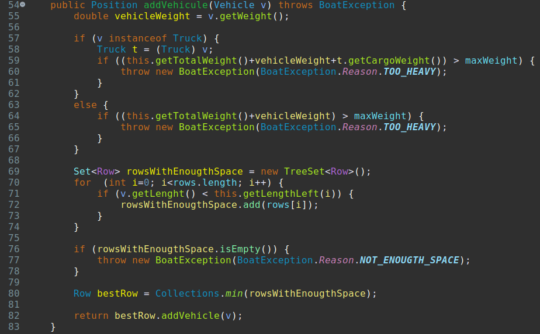
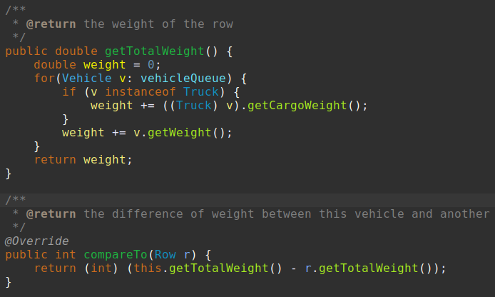
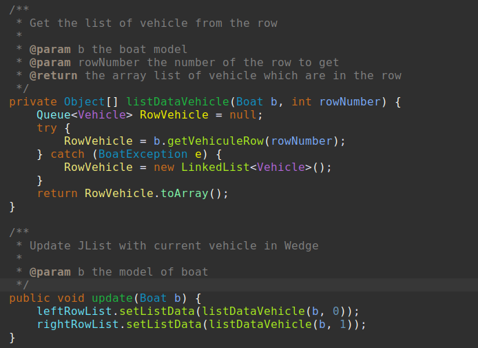
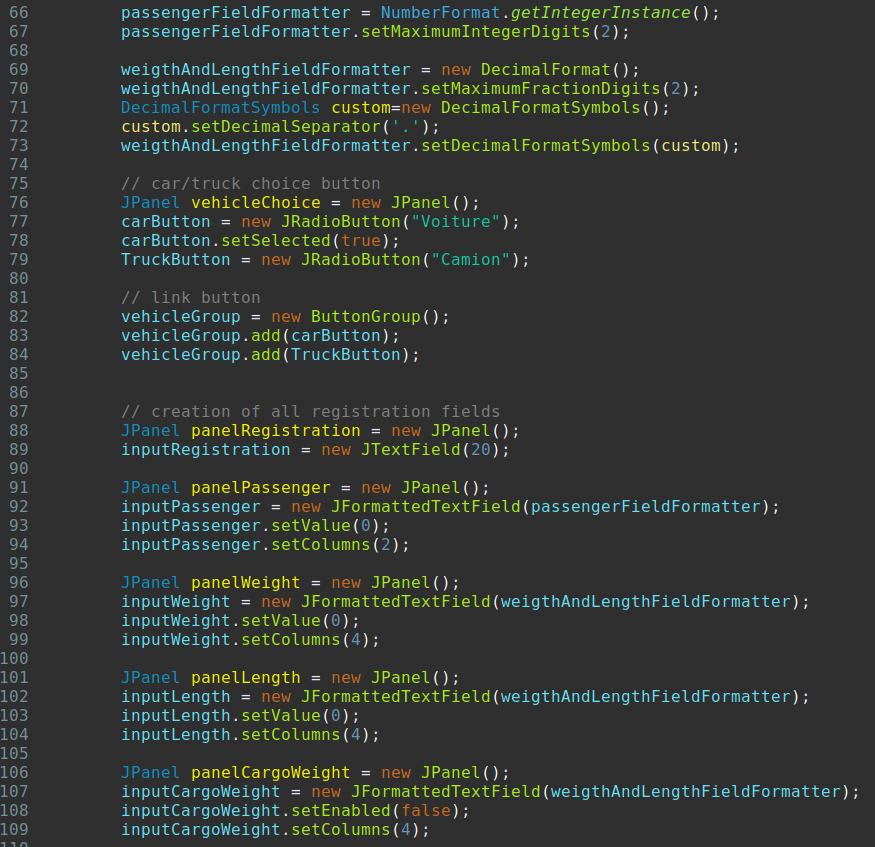
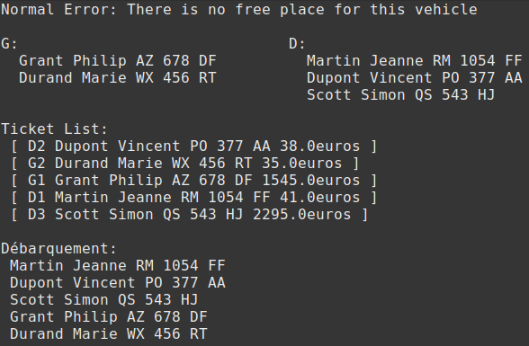
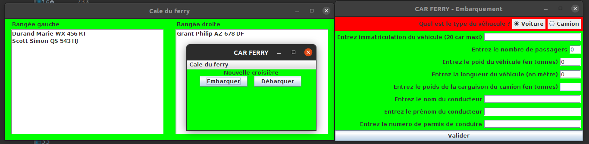

<div align='center'>

# Project Carferry

## Université de Franche-Comté

### Alphée GROSDIDIER & Quentin OBERON

</div><hr>

Rapport demandé en français

## Présentation de l'applications

### Sujet

Il nous était demandé de créer une application tout d'abore sous forme textuelles puis sous forme graphique de géstion de chargement et déchargement d'un ferry avec gestion des tickets.

Tous d'abord nous devions créer une classe camion et voiture pérmettant respectivement de charger et décharger un camion et une voiture.
Les deux types de véhicules doivent poivoir avoir un conducteur, une plaque d'immatriculation, un longueur et un poid.
Plus spécifiqauement un camion doit avoir le poid de se cargaison et une voiture, le nombre de passager qu'elle transporte.

Le conducteur est définit pas un nom et un prénom ainsi qu'un permis de conduire.

La cale doit pouvoir contenir des camions et des voitures, elle doit permettre des les charger et de les déchargér.
Elle a plusieurs particularités. Elle peux contenir seulement une certaine masse définit en Tonnes et a une certeine longueur définit en mètres.
De plus on doit répartir équitablement les véhicules pour que le bateu ne penchent pas plus d'un côté que de l'autre.
Les véhicules sont chargées en file, c'est a dire que le dernier véhicule chargé doit sortir en dernier et le premier chargé doit sortir en premier.

On a une gestion idépendante du prix des camions et des voitures.
Un camion côute pour la traversée un prix de 45€ + 0.1€ * (poid de sa cargaison).
Une voiture côute (avec son conducteur) 35€ + 3€ * (nombre de passagers).
Un ticket est créer lors de l'embarquement.

Le ticket est composé du nom et prénom du conducteur, de la position du véhicule dans la cale et du tarif du voyage.
La position du ticket est noté par la lettre de la rangées et la position dans la rangée.
La lettre est soit 'G' pour gauche soit 'D' pour droite.
Les tickets sont enregistrées et triées par ordre alphabétique des conducteurs.

Il y auras aussi une gestion des erreurs d'embarquement pour un cale qui ne peux pas accepter le véhicule car il est trop lourd ou parce qu'il est trop long et qu'il n'y a plus de place.

### Nos Choix

#### Les choix sur l'interface textuelle

Nous avons tout d'abord construit l'application de façon textuelle.
Sachant que nous devions ensuite la porter en mode graphique, nous avons fais une classe regroupant toutes les méthodes que nous aurions besoin pour développer notre interface.
Nous somme partis sur l'interface nommée "Boat".

Nous avons ensuite choisis de bien séparer nos modules (nos classes) pour que le project soit lisible et pour que l'implémentation de nouvelles fonctionnalitées soit plus simples.
Nous avons donc choisis de creer un module qui se chargerais de la gestions des véhicule dans l'application et un autre du prix du trajet.
La liste des ticket du trajet a été laissé dans cette classe pour ne pas s'encombrer de plus de méthodes dans la classe "Wedge".

Par rapport au sujet nous avons prix la liberté de modifier la classe véhicule.
Nous n'avons pas ajouter une méthode abstraite dans la classe véhicule pour avoir le prix du véhicule mais nous avons plutôt fais une classe qui se charge de donner le prix.
Ce choix a été principalement fait pour donner plus de lisibilité dans le projet en regroupant le meme type d'information au même endroit, ici le prix.

Un autre choix qui esty différent de celui proposé dans le sujet est celui de la classe ticket.
Nous avons tout d'abord changer la façon d'enregistrer la position du véhicule dans la cale.
Nous avons creer une classe position qui nous permet de transmettre plus facilement la rangée et la position dans la rangée.
Puis nous n'enregistrons pas la rangé avec une lettre 'G' ou 'D' mais avec un nombre permettant d'avoir un nombre indéfinis de rangée.

Sur Ticket nous avons aussi pris la liberté d'enregistrer directementy le véhicule et pas les informations relative au conducteur et au véhicule.
Nous avons fais ce choix pour éviter la duplications d'information même si, une fois enregistré, le véhicule ne peux plus changer.

On a aussi décider d'enregistrer les véhicule dans des classes "Row" pour nous silplifier les algorithmes au lieu de faire une liste statique de Queue.

Pour les points les futiles, nous avons ajouter une vérifications de certaines érreurs d'enregistrement courrante comme l'ajout de deux fois le même véhicule, le même conducteur pour deux véhicule différent et l'ajout d'un véhicule alors qu'on fais un débarquement.

#### Les choix sur l'interfaces graphique

Nous avons voulus rester au plus proche de ce qui était demandé. Nous n'avons donc pas changer la couleur (ca pique les yeux, désolé) et nous avons éssayé de rester au plus proche de l'interface qui nous étais présenté en image.

Nous avons cependant fait quelques modifications sur l'affichage des fenêtres.
Nous pouvons a la fois ouvrir la fenêtre de la cale et ajouter ou supprimer des véhicules.
L'interface de la cale se met automatiquement a jour suite a l'ajout ou la suppression d'un véhicule.
Et il y a un affichage de tous les messages d'érreur suite a un ajout impossible du véhicule.

Nous avons aussi fais quelques changement sur la fenêtre d'ajout d'un véhicule.
Il y a un formattage automatique des nombres pour le poid du véhicule, le nombre de passagers et le poid de la cargaison.
Pour le reste des champs de saisis ils sont seulement vérifiées lors de la validation du formulaire.

Ce sont les seules libertées que nous avons prises par rapport au sujet.

## Conception de l'application

### Diagramme

```{.mermaid width=1600}
classDiagram

Boat "1" -- "1" Wedge
Boat "1" -- "*" Ticket
Boat "1" -- "1" Accounting

Row "1" -- "*" Vehicle
Row --|> Comparable~E~ : Implements
Wedge "1" -- "many" Row
Vehicle <|-- Car
Vehicle <|-- Truck
Vehicle "1" -- "1" Driver
Ticket "1" -- "1" Vehicle
Ticket --|> Comparable~E~ : Implements
Ticket "1" -- "1" Position

class Comparable~E~ {
    <<interface>>

    +compareTo(E e) int
}

class Position {
    -int row
    -int pos

    +getRow() int
    +getPos() int
}

class Driver {
    -String name
    -String firstName
    -int permNumber

    +equals(Object o) boolean
    +getName() String
    +getFirstName() String
    +getPermNumber() int
}

class Vehicle {
    <<abstract>>
    -String registration
    -double weight
    -double length
    -Driver driver

    +getDriver() Driver
    +getWeight() double
    +getLength() double
    +getRegistration() String
}

class Car {
    -int passengersNumber

    -getPassengerNb() int
}

class Truck {
    -double cargoWeight

    -getCargoWeight() double
}

class Row {
    -Queue~Vehicle~ row
    -int rowNumber

    +getTotalVehicleLength() double
    +getVehicleNumber() int
    +addVehicle(Vehicle v) Position
    +removeVehicle() Vehicle
    +getTotalWeight() double
    +haveVehicleWithSameRegistration(String registration) boolean
    +haveVehicleWithSameDriver(Driver driver) boolean
}

class Wedge {
    -double length
    -double maxWeight
    -final double spaceBetweenVehicles
    -Row row[]
    

    +addVehicle(Vehicle v) Position
    +removeVehicle() Vehicle
    +getVehicleRow(int rowNumber) Queue~Vehicle~
    -getLengthLeft(int rowNumber) double
    -getTotalWeigth() double
    -isEmpty() boolean
}

class Ticket {
    -double price
    
    +getName() String
    +getFirstName() String
    +getRegistration() String

    +getPlaceInWedge() Position
    +getPrice() double
    +equals(Object o) boolean
}

class Accounting {
    -final double baseCarPrice
    -final double baseTruckPrice
    -final double pricePerPassenger
    -final double pricePerKgCargo

    +getPrice(Vehicle v) double
}

class Boat {
    -Wedge wedge
    -Accounting accounting
    -Set~Ticket~ listing
    -boolean canLoad
    -int passengers

    +addVehicle(Vehicle v) Ticket
    +removeVehicle() Vehicle
    +getVehicleRow(int rowNumber) Queue~Vehicle~
    +getListingTicket() Set~Ticket~
    +getTicketFromVehicle(Vehicle v) Ticket
}
```

### Boat

C'est la classe principale de l'application en mode console.
Elle centralise toutes les opérations de l'application et permet la communication entre la cale du bateau (wedge), la billetrie et les prix (Accounting).
On a preferer gerer indépendament la cale du bateau pour pouvoir inclure d'autres modules comme un module bar ou un bureau d'échange.
Tous les prix serons alors ajustée directement depuis le bateau.

Nous avons chois de lister tous les tickets fait pour les véhicules dans le bateau directement mais nous aurions pus les mettres dans la cale, c'est un choix objectif qui a été fait.

Pour enregistrer les tickets nous avons choisis d'utiliser un Set de la bibliothèque java.
Tous les tickets sont unique, il n'y a qu'un conducteur pour chaque véhicule qui ont chancun une plaque d'imatriculation unique.
On a aussi besoin de les ordonnées selon le nom du conducteur donc on a une seule façon de faire l'implémentation du Set.
On implémente le set avec un TreeSet car on ne veux pas d'éléments nulle et il est plus simple de manipuler les élément a l'intérieur.

### Wedge

La Cale est la classe qui regroupe toutes les méthodes relatives a la dispositions des véhicules dans le bateau.

Nous avons implémenté une liste statique de Row (rangée) car une collections était inutiles pour les opérations d'ajout et de suppression selon notre implémentation.
De plus une fois la créatrion de l'instance Wedge on a aucun ajout ni suppression de rangée.
On a selement besoin d'acceder a des rangées spécifiques.

Notre méthode d'ajout ou de suppression ne prend pas en compte la ligne de flotaison, elle permet simplement d'ajouter un véhicule a la rangée sui a le moins de poids et de retirer le vhéhicule a celle qui a le plus de poids.

### Row

La classe rangée (ROW) permet l'ajout et la suppression des véhicules dans la rangée.
Elle comporte des méthodes pour connaitre son poid, le nombre de véhicules et les méthodes d'ajout et suppressions de véhicule.

Nous avons décidées d'utiliser une Queue pour le stockage des véhicules.
Elle nous permet seulement l'ajout de véhicule en fin de que et la suppréssion en fin de queue.
On a préféré utiliser la méthode que pour éviter d'enlever en premier le dernier véhicule ajouté ou l'inverse.
On a utiliser une LinkedList qui n'est pas forcément la plus éfficace puisque l'operation d'ajout ou de suppression est de O(n).
Cependant elle nous évite d'enlever ou ajouter un véhicule qui physiquement ne peux pas l'être.

Cette classe implémente la classe Comparable pour pouvoir ordonner les classes et touver rapidement celle qui a le plus ou le moin de poid selon notre algorithme.

### Accounting

Cette classe a pour simple but de gerer les prix de tous les éléments vendables dans le bateau.
Elle enregistre les prix de chaques éléments et on peux connaitre le prix de l'élément en appelan la methode gePrice.

### Ticket

Cette classe enregistre les informations relative aux tickets.
Elle implémente la classe Comparble pour pouvoir fonctionner avec le Set de la classe bateau (Wedge).

Pour éviter la duplications de variables nous avons directement lier le véhicule au ticket
On a ajouter une classe Position pour enregistrer la position du véhicule dans la cale duran le voyage.

### Position

Cette classe enregistre la position de la voiture liè au ticket.
La rangée est enregisté sous forme d'entier pour permettre de mettre un nombre illimité de rangée.
Il est demandé d'afficher la rangée droitre par un D et la rangée guauche par un G.
Nou traiterons ces cas par l'affichage et seulement pour un bateau a 2 rangées.

### Vehicle

La classe véhicule (Vehicle) est hérité par les camions (Truck) et voiture (Car) permettant de les stockées dans une liste unique de véhicules.

Elle possède les fonctions de base qui sont le conducteur, la plaque d'imaticulation, le poid et la longueur qui sont commune aux camions et voiture.
Cette classe est abstraite puisqun ne peux charger un véhicule, seulement des camions et voiture.

Pour parler rapidement des classes voiture et camion.
La classe voiture perment d'enregistrer un nombre de passager alors que les camions ne transportent pas des passager mais des cargaisons (sauf transport illégal).

## Développement de l'application

### Points intéréssants

Dans cette partie nous avons décider de parler des modifications importantes faites au project qui difèrent du sujet.
Nous allons donc parler de l'ajout d'un véhicule dans la cale puisque nous l'avons implémenté d'une manière particulière mais fonctionnelle.

#### Ajout des véhicules



Sur cette image nous avons le script d'ajout d'un véhicule au bateau. Les premières lignes ne sont pas intéréssantes.
Elles ne servent qu'a verifier que le poid du véhicule peux être supporté par le bateau.
C'est a partir de la ligne 69 que le code est intéréssant.
On créer un Set de rangées (ROW) dans laquelle on va ajouter toutes les rangées qui ont assez d'éspaces pour acceuilir la longueur du véhicule.
Et grace au Set elle va les organiser selon leur méthodes compareTo qu'on détailleras un peu après.
On va donc mettre dans ce Set les rangées possibles pour mettre le véhicule.
Ensuite on vérifie qu'il y a au moin une rangée de libre sinon on n'a plus d'éspace disponible pour ce véhicule.
Et on ajoute a la rangée qui a le moins de poids, le véhicule.
On utilise la méthode "min" de collection pour nous donner ce résultat.
Cette opération est en O(1) car on a ordonner nos éléments par poids.
On peux voir comment est implémenter la méthode compareTo de "ROW" pour vérifier que c'est le poid de chacune des rangées qui est comparée.



Sur cette capture d'écran on a la fonction compareTo de la classe "ROW" qui compare simplement le poid de la rangée avec une autre passé en paramètre.
Le poid de la rangée est le poid de tous les véhicules qui s'y trouvent.

#### Mise à jours des éléments de la fenetre de la cale



Dans ce bout de code on peux voir une fonction update.
Elle permet de mettre a jour la fenetre montrant la cale du bateau.
La fonctuion setListData de leftRowList et rightRowList (JList) permet de remplacer le contenu des JLisst par les arrays d'object passé en paramètres.
Ce role est remplis par listDataVehicle qui va récuperer les informations de rangées et retourner un array d'object.
Donc a chaque fois qu'on effectue une opération d'ajour ou de suppression de véhicule, on appele cette fonction pour mettre a jour la cale du bateau

#### Formattage des nombres dans le formulaire d'embarquement



On a choisi de faire un formattage des nombres directement dan l'interface graphique pourc que l'interface soit plus simple et pour que les nombres soient correctement formatées.
Par exemple, oon ne veux pas que le nombres de passagers soit a virgule.
Il est difficile de conevoir qu'il y ait 1/3 d'une personne qui souhaite faire la traversé.

On a donc utiliser a la ligne 66 une instance de Integer que l'on a mis au maximum a deux chiffres pour éviter de devoir transporter plus de 100 personnes.
On utilise ensuite a la ligne 92 un JFormattedText que l'on initialise avec notre instance d'Integer pour que les deux puissent fonctionner correctement.

Pour les nombres qui peuvent être de nombre a virgule on utilise des DecimalFormat avec lequel  on met un maximum de deux nombres après la virgume.
Puis on a décider de changer le séparateur qui est initialement une virgule par un point.
Le tout pour faciliter la saisie de ces nombres.
Ensuite on instancie de la même façon la saisie pour le poid du véhicule a la ligne 97 et pour le poid de la cargaison a la ligne 102.

Le formattage se fais automatiquement lors du changement de la zone de saisie.

### Partage du travail

### Les résultats obtenus





### Ce qui a été tésté

#### Dans le programme textuel

Pour la partie du programme qui sert de modèle, on a développé une suite de tests contenues dans TestBoat.

Nous avons séparer nos test en différentes catégories:

* le chargement

* le déchargement

* le gestion des tickets

* la gestion des prix

##### Le chargement

Nous avons tout d'abord testé si le bateau est bien vide lors de sa création.
Ensuite si le chargement d'un véhicule s'éffectuait correctement puis si le chargement de plusieurs véhicules fonctionnaitt aussi et ne créait pas de problèmes
On a vérifié les éxeptions lièes aux chargement.
On effectue les tests pour verifier que l'exeption due a un manque de place en logueur et que l'exeption due a un poid trop important sont levées.

On vérifie aussi que le placement des véhicules correspond bien a ce que l'on a souhaité.
Et nous avons vérifié que le bateau ajoutais correctement les passagers sur le pont.
Et pour le bonus nous vérifions si le bateau n'as pas déjà chargée un véhicule avec un même conducteur ou un autre véhicule avec la même plaque d'imatriculation (car cencée être unique)

##### Le déchargement

Nous avons vérifié que le bateau se déchargeait correctement (comme on le souhaitais), 
Nous avons vérifié aussi que les passagers déscendaient bien avec les bon véhicules.
Les tests vérifiaient aussi la présence des exeptions pour le déchargement lorsque le bateau est vide ainsi que le chargement alors que l'on est en train de décharger le bateau.
Dans la même logique on a vérifié que l'on pouvait remettre des véhicules dans le bateau après le déchargement complet.

##### La gestion des tickets

Lorsqu'on demande le ticket d'un véhicule qui n'existe pas, on vérifie que le retour est bien vide, on vérifie aussi dans le cas contraire que le ticket existe si le véhicule a été chargée.
Ensuite on fais une vérification que chaques éléments du ticket est valide par rapport aux données attendues.

##### La gestions des prix

On a fais des vérifications succinctes pour cette classe comme c'est des calculs assez basiques.
On fais une vérification pour seulement quelques camions et quelques voitures.

#### Dans le programmme graphique

Pour tester la partie graphique nous n'avons pas creer des tests automatiques.
Nous avons donc vérifié manuellement les cas possibles d'utilisations.

### Ce qui n'as pas été implanté

Le programme produit respecte les consignes et toutes les fonctionnalitées demandées sont incluses dans le programme.
On a donc tout implémenté sans rien oublier (normalement).

Pour l'ajout d'un véhicule nous avons vérifié si chacuns des paramètres étaient bien vérifiés avant d'éssayer d'ajouter le véhicule au bateau. Nous avons aussi fais la vérification que le bon type de véhicule était ajouté.
Pour ce qui est de l'interface en elle même nous avons bien la désactivation des champs inutiles au véhicule (désactivation du champ passager pour les camions et désactivation du poid de la cargaison pour les voitures).

Pour la fenêtre de la cale, l'affichage des informatios fonctionnent et correspond bien au véhicule sélectionné et que les informations sont correctes.
On vérifie que le fenêtre se met bien a jour lorsqu'on ajoute ou enlève un véhicule.
Pour ces vérifications tous fonctionnent comme souhaité.

Pour les derniers test on vérifie bien que les fenêtres d'informations apparaissent aux bons endroits et correspondent aux bonnes informations.

## Conclusion

### Bilan pour le travail en binôme

### Bilan du travail pour la formation

### Améliorations possibles mais non réalisées

#### Amélioration du modèle

Il ya pas mal d'améliorations que l'on pourrait apporter a ce projet mais par manque de temps nous avons donc fais le choix de ne pas les implémenter.

Tout d'abord nous avons choisis de pouvoir créer une cale avec un nombre de rangées indéfinie.
Cela pose un problème par rapport au sujet d'origine sur l'ajout et l'enlèvement des véhicules.
Dans la vraie vie, un bateau a une ligne de flotaison qu'il faut respecter donc une ammélioration de la disposition des véhicule est a considéré dans le cas d'un bateau qui contient plus de deux rangées.

On purrais ajouter aussi un maximum de poid entre la rangée avec le maximum de poid et celle qui a le minimum de poid pour aider justement a stabiliser cette ligne de flottaison.

Dans la partie modèle du projet on aurais pus ajouter une classe "History" pour conserver la date du trajet ainsi que tous les tickets des véhicules ayant fait cette traversée. On pourrais alors voir plus facilement les bénéfices et les coûts du tajet.

On pourrais aussi ajouter d'autre types de véhicules comme les bus qui sont des voitures qui transporent plus de passager (qu'on aurrais pus limiter a 7 passagers maximum) et des motocycles par exemples.
On pourrais aussi accepter des passagers sans voitures mais on s'éloigne du sujet.

Pour faire plus complexe on pourrais ajouter le temps de trajet, le coût du carburant au kilomètre et par kilos, avoir le coût total d'un trajet etc.

#### Amélioration de l'interface

On pourrais aussi améliorer l'interface graphique pour être ausi modulable en fonction du nombre de rangées, mais dans un soucis de rester proche du sujet nous avons vréer une interface avec seulement deux rangées.

On pourrait avoir un récapitilatif des recettes du trajet, un historique des trajet avec la liste des véhicules etc.
Les dépences et les bénéfices de chaques trajet.

#### Les améliorations hors projet

On pourrait faire une gestions d'un bureau de change dans le bateau, une boutique de souvenir et un bar.
On pourrait aussi faire la gestions de plusieurs bateau avec leur historique, leur recète, dépences et bénifices pour chaque modules.
Mais cela est pour une gestion beaucoup plus approfondis du projet et n'est pas forcément intéréssant dans le cadre d'apprentissages de l'algorithmique de base.