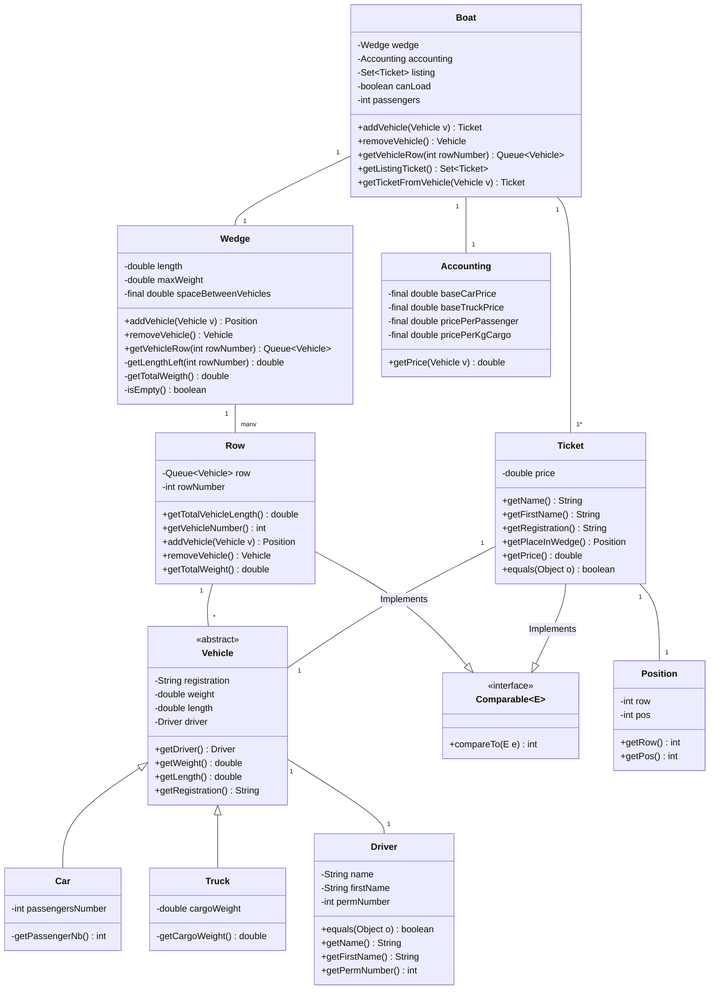

# Analise du projet Carferry

[//]: # (Quentin Accounting Ticket Postion Vehicle)
[//]: # (Moi le reste)

## Boat

This is the main class of this application.
We decided to make this class to group all boat methods and to have one interface.Then we can add easly a class BAR or EXCHANGE OFFICE.
We put listing directly in this class but we can put it in wedge too.
We choose a Set for listing because we must be organise and all tickets are unique (one ticket per each different vehicle)

## Wedge

Group all methods for contain and manage vehicles. We set length, maxWeight and spaceBetweenVehicle here because it's common with all rows and all rows info are only used by this class.
getTotalWeight(), getTotalVehicleLength() and getVehicleNumber() are only used by imself but if we want more information we can have here.

## Row

Manage vehicles in unique row. We implements comparable to sort easly rows when adding and removing vehicle from Wedge.

## Accounting

The purpose of this class is to simplify the creation of the ticket price by returning to the main class (boat) the value of the trip for the type of vehicle requested. The prices are stored in the class as a variable.

## Ticket

This class allows to retrieve and store all the information related to the ticket. The total price of the ticket is stored in the variable price, the methods are used to retrieve the other information about the ticket contained in the other classes.

## Comparable

It allows to sort the tickets in order to be able to store them in the variable "Set" From the Boat class

## Position

This class stores the position of the car linked to a ticket. The column is stored in the form of INT to allow the application to be adapted if a cargo has more than two parking lanes.

## Vehicle

The Vehicle class is inherited by two classes: Car and Truck. The class stores the information of the vehicle: Its driver its size is weight and the ticket that is assigned to it. Its daughter classes allow to store additionally for a car its number of passengers and for a truck its weight.

